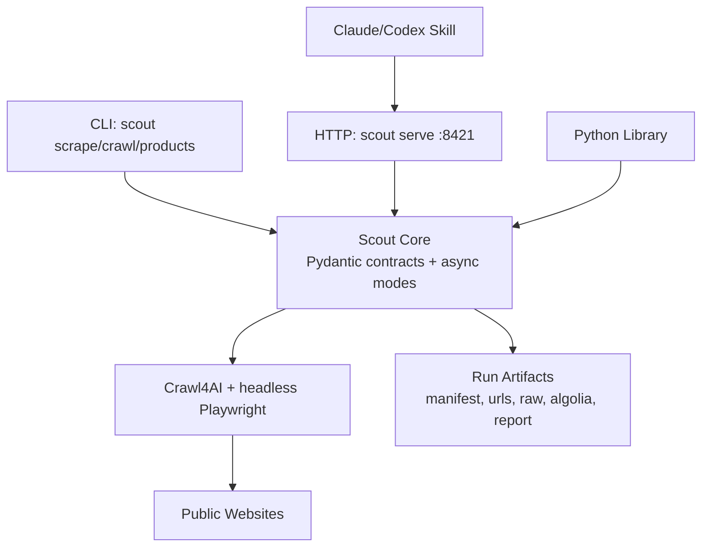
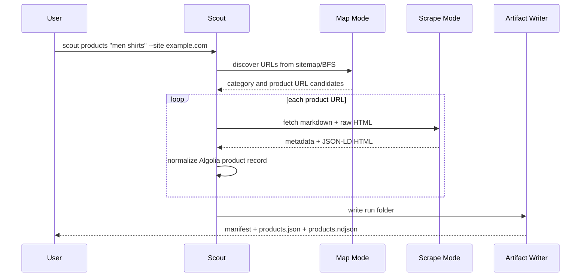

# Scout Architecture

Scout has one engine and several front doors.

## Runtime Modes

### CLI

CLI commands execute directly through the Python package. They do not require
the local HTTP server.

### HTTP Service

`scout serve` starts FastAPI on port `8421`. This mode is for agents, curl,
PRISM, external scripts, and browser-visible API docs.

### Skill

The skill is not the product. It is a playbook that tells Claude or Codex how
to use the running Scout service for research and product ingestion tasks.

### Browser Behavior

Scout does not depend on the user's visible browser. Crawl4AI launches headless
Chromium internally through Playwright when JavaScript rendering is needed.

## Product Crawl Flow

