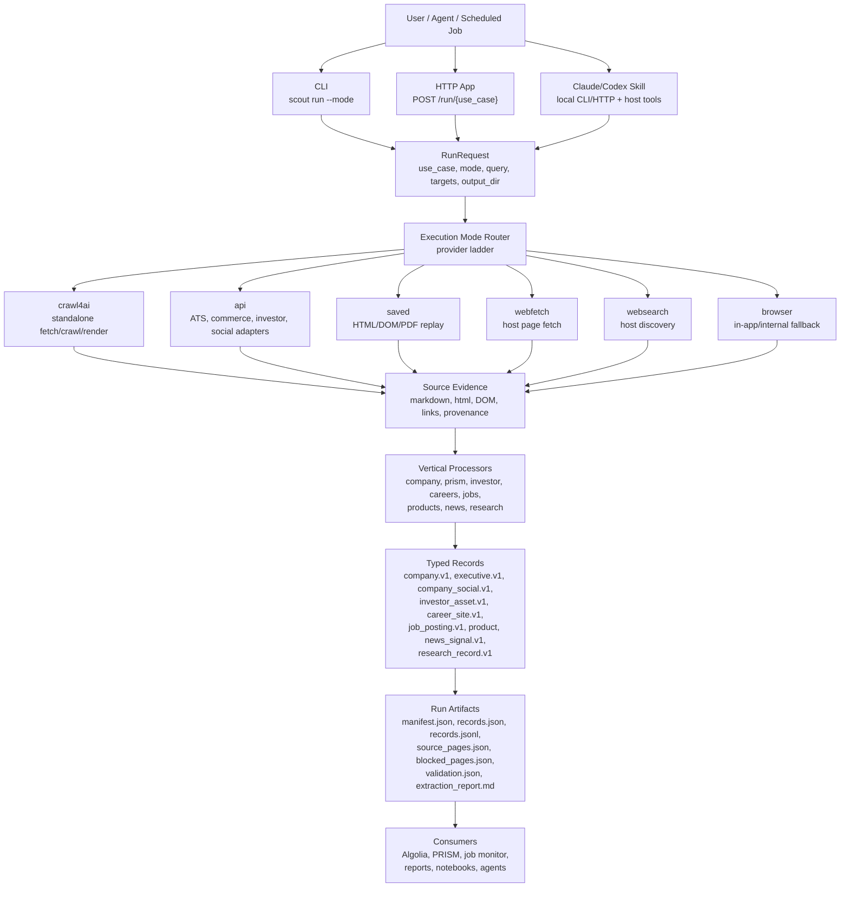

# Scout Architecture

Scout is a provider-agnostic web intelligence platform with three front doors:
standalone CLI, standalone HTTP app, and Claude/Codex skill. The core engine
normalizes acquisition evidence into typed vertical records and writes one
portable artifact contract for every run.



## Execution Mode Ladder

`auto` is the default. It tries provider paths in this order:

1. `crawl4ai`
2. `api`
3. `saved`
4. `webfetch`
5. `websearch`
6. `browser`

Browser is intentionally last because it is expensive, host-dependent, and
harder to automate in standalone contexts. It is still critical for blocked,
interactive, or JavaScript-heavy pages when the host exposes an internal
browser session.

## Front Doors

### CLI

The CLI is the package-native interface. It works after `pip install` and does
not require the HTTP server.

```bash
scout run company --query Adobe --mode auto --output-dir ./scout-runs/adobe
scout run jobs --profile ./private-job-profile.yaml --mode api --output-dir ./scout-runs/jobs
scout products "men shirts" --site lacoste.com --output-dir ./scout-runs/lacoste
```

### HTTP

The HTTP app is for agents, PRISM, scripts, and browser-visible API docs.

```bash
scout serve
curl -s -X POST http://localhost:8421/run/company \
  -H "Content-Type: application/json" \
  -H "X-API-Key: ${SCOUT_API_KEY:-dev-key}" \
  -d '{"query":"Adobe","mode":"auto","output_dir":"./scout-runs/adobe"}'
```

### Skill

The skill is a playbook. It should choose the lightest available path:

1. Use local CLI or HTTP when Scout is installed.
2. Use host WebFetch/WebSearch when the host has better access to content.
3. Use browser fallback only for blocked, JS-shell, or interaction-heavy pages.
4. Normalize all evidence into Scout records and artifacts.

## Vertical Processors

| Use case | Purpose | Primary records |
|---|---|---|
| `company` | Website, about page, leadership, socials, key URLs | `company.v1`, `executive.v1`, `company_social.v1` |
| `prism` | Algolia prospect research bundle | company, careers, investor, news records |
| `investor` | IR pages, filings, reports, decks, events | `investor_asset.v1` |
| `careers` | Careers page, ATS, departments, hiring signals | `career_site.v1` |
| `jobs` | Job extraction, matching, scoring, monitoring | `job_posting.v1` |
| `products` | Product/category extraction for Algolia | product records |
| `news` | Newsroom/blog/recent announcements | `news_signal.v1` |
| `research` | Generic web/page/document research | `research_record.v1` |

## Validation Targets

Scout validates against a balanced target matrix rather than a SaaS-only sample:

- Private B2B SaaS: Algolia, Constructor
- Private retail commerce: L.L.Bean, Patagonia
- Public companies: Adobe, Home Depot
- Specialized primary targets: Estée Lauder for hard-site retail behavior and
  British Airways for travel/research/website-quality behavior

Secondary targets include Nike, Amplience, Salesforce, and Intuit. The
executable registry lives in `scout.core.platform.targets`; see
[docs/target-matrix.md](target-matrix.md).

## Artifact Contract

Every high-level run writes:

```text
manifest.json
records.json
records.jsonl
source_pages.json
blocked_pages.json
validation.json
extraction_report.md
```

The artifact contract is what lets Scout move cleanly between CLI, HTTP, skill,
scheduled jobs, PRISM, Algolia indexing, and future notebooks.

## Citation Model

Scout separates source registry from record citations:

- `source_pages.json` is the source registry. Each entry has a deterministic
  `source_id`, source URL, final URL, provider, fetched time, blocked/error
  state, status code, content hashes, title, and content availability flags.
- `records.json` and `records.jsonl` carry `citations[]`. Each citation points
  to a `source_id` and names the field, claim, snippet, optional selector, and
  confidence.
- `validation.json` records `missing_citations` warnings when a record is
  emitted without structured citations.

This is the boundary between page-level provenance and PRISM-grade evidence.
